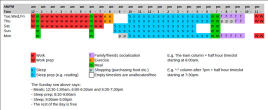

# How to create a sleep schedule for a regular-hours shift worker

Having a sleep schedule might not fix insomnia, however you may not be
able to fix your insomnia problems without one. In other words, it may
be a prerequisite to fixing your insomnia problems.

To have a regular sleep schedule, you probably need to find a schedule
for most or all of the activities in your whole week. I suggest a method
below.

## Objective

To find a sleep schedule which fits in with your own circumstances
including, time for family, friends, exercise, etc.

This method should be suitable for those who perform **shift work** at
at the **same hours** each workday (e.g. 1:00 - 7:30 Tuesday to Saturday).

## Method

1. List all *fundamental* activities which you do each week.
1. Divide those activities into 3 categories:
   - *Immovable activities*: That is, we have little or no control over
     the scheduling of the activity. E.g. Attending work or school.
   - *Movable and long activities*: That is, we can control or negotiate
     the scheduling and the activity takes over 2-3 hours.  E.g. Sleep
     time or time spent with family and friends.
   - *Movable and short activities*: That is, we can control or negotiate
     the scheduling and the activity takes less than 2-3 hours.
     E.g. Meals, shopping and exercise.
1. Create a schedule by assigning start/end times (and days of the week)
   as follows:
   - assign activities from the *Immovable activities* list first
   - fit in activities from the *Movable and long activities* list next
   - finally fit in activities from the *Movable and short activities*
     list
1. Repeat any or all steps in the above method to see if you can
   resolve any scheduling conflicts or improve the schedule. You
   may need to make compromises (e.g. remove or split some less
   important activities).

Like all scheduling problems, this method is not guaranteed to work.
For example, if you have conflicting schedules in the *Immovable
activities* category then you need to find a solution outside of the
scope of this discussion. (You will probably need to move or remove 
one of the conflicting activities... or purchase a time machine!)

## Example

1. List of weekly *fundamental* activities:
   - Sleep
   - Family/friends socialisation
   - Work
   - Meals
   - Shopping
   - Exercise
1. Divide those activities into 3 categories:
   - *Immovable activities*:
     + Work
   - *Movable and long activities*:
     + Sleep
     + Family/friends socialisation
   - *Movable and short activities*:
     + Meals
     + Shopping
     + Exercise
1. Create a schedule:

*Sleep schedule timeline using 24 hour clock and half-hour timeslots
(click to see PDF).*

**Question:** What will you do with your free time, Sun,Mon 1:00-7:30
(that is on the days you don't work)?

**Answer:** Perhaps you need to find some solitary recreational
activity (such as reading, a hobby, study, etc.) and perhaps a
chance to catch up on household bills, paperwork and chores.

